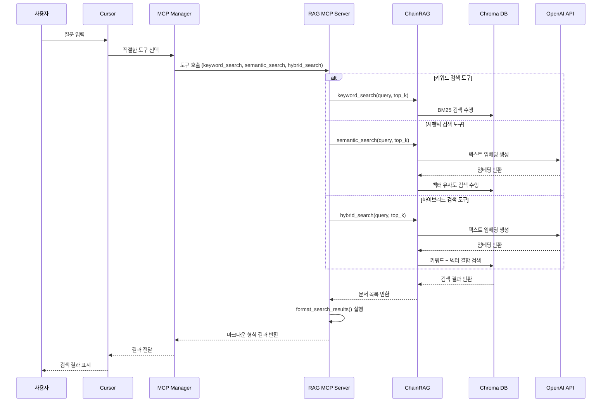

# RAG 시스템 시퀀스 다이어그램

아래 다이어그램은 Cursor와 MCP 서버 간의 상호작용을 통해 PDF 문서에서 정보를 검색하고 표시하는 과정을 보여줍니다.

## RAG MCP 시스템 시퀀스 다이어그램 설명

### 주요 컴포넌트:

1. **사용자**: Cursor를 통해 질문을 입력합니다.
2. **Cursor**: 사용자 인터페이스를 제공하고 MCP 매니저와 통신합니다.
3. **MCP Manager**: 사용자 질문에 따라 적절한 도구를 선택하고 호출합니다.
4. **RAG MCP Server**: 실제 검색 기능을 제공하는 서버로, 세 가지 검색 방식(키워드, 시맨틱, 하이브리드)을 지원합니다.
5. **ChainRAG**: PDFRetrievalChain 클래스를 통해 PDF 문서 처리와 검색 로직을 구현합니다.
6. **Chroma DB**: 벡터 데이터베이스로, 문서 내용과 임베딩을 저장하고 검색합니다.
7. **OpenAI API**: 텍스트 임베딩 생성 및 필요시 LLM 기능을 제공합니다.

### 주요 흐름:

1. 사용자가 Cursor를 통해 질문을 입력합니다.
2. Cursor는 MCP Manager를 통해 질문을 분석하고 적절한 도구를 선택합니다.
3. MCP Manager는 선택된 도구(keyword_search, semantic_search, hybrid_search)를 RAG MCP Server에 전달합니다.
4. RAG MCP Server는 선택된 검색 방식에 따라 다음 작업을 수행합니다:
   - **키워드 검색**: BM25 알고리즘을 사용하여 정확한 단어 매칭 검색
   - **시맨틱 검색**: OpenAI API를 통해 임베딩을 생성하고 벡터 유사도 검색
   - **하이브리드 검색**: 키워드 검색과 시맨틱 검색을 결합한 방식 사용
5. Chroma DB에서 검색 결과를 받아 처리합니다.
6. RAG MCP Server는 검색 결과를 마크다운 형식으로 포맷팅합니다.
7. 포맷팅된 결과는 MCP Manager를 거쳐 Cursor로 전달됩니다.
8. Cursor는 최종 결과를 사용자에게 표시합니다.

이 시스템은 사용자의 요구에 따라 적절한 검색 방식을 선택하여 PDF 문서에서 정보를 효과적으로 검색하고 표시합니다. 